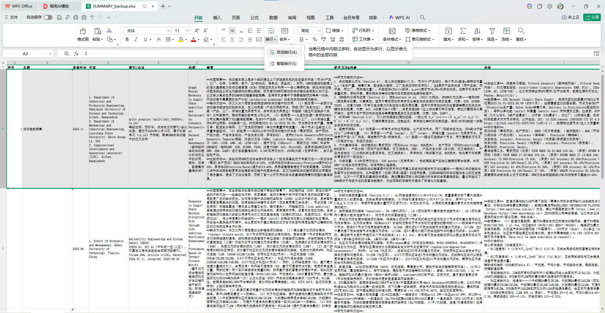

# 📄 Paper Master

> AI-powered academic paper reading assistant — extract structured notes from PDFs into an Excel master table.

**Paper Master** 是一个论文阅读与结构化提取框架——将 PDF 研究论文自动提取为结构化笔记，追加到 Excel 总表中。核心工作流不限于特定 AI 平台：PyMuPDF 处理 PDF 文本提取，AI Agent 负责智能论文理解，openpyxl 进行表格写入。本文档以 **Claude Code** 作为示范平台提供开箱即用的 Skill，但 SKILL.md 中的提取规范同样可以适配其他 AI 编码助手（如 Copilot CLI、Gemini CLI 等）。

> **Paper Master 是一个可定制框架**——所有提取字段、输出格式、内容要求都定义在 `SKILL.md` 中。你可以通过修改这个文件来适配自己的需求，比如增减字段、调整摘要结构、改变写作风格等。详见下方 [自定义](#-自定义--customization) 章节。

---

## ✨ 提取字段 / Extracted Fields

每篇论文提取以下 10 个字段，按顺序写入 Excel 第一张表：

| # | 字段 | 说明 |
|---|------|------|
| 1 | **标题** | 英文标题 + 中文翻译（换行分隔） |
| 2 | **作者（机构/学校）** | 仅机构名，不写个人姓名 |
| 3 | **发表年份** | YYYY.MM 格式 |
| 4 | **期刊/会议** | 全名 + IF/分区/CCF 等级 |
| 5 | **摘要** | 问题背景 / 解决方法 / 达到目标 三要素 |
| 6 | **研究方法&内容** | 方法细节 + 达成目的 |
| 7 | **实验** | 工具 / 数据集 / 评价指标 |
| 8 | **相关工作** | 3~6 条，含差异/局限分析 |
| 9 | **自我思考** | 创新点 / 优势 / 局限 / 启发 |
| 10 | **有无代码** | 代码链接或标注无 |

---

## 🚀 快速开始 / Quick Start

> 以下以 **Claude Code** 为示范平台。Paper Master 的核心规范（`SKILL.md`）同样可适配 Copilot CLI、Gemini CLI 等 AI 编码助手。

### 1. 安装依赖

```bash
pip install PyMuPDF openpyxl
```

### 2. 在 Claude Code 中安装本 Skill

将仓库克隆到本地后，用 Claude Code 的 `/plugin` 命令安装本地插件：

```bash
git clone https://github.com/noranskn/paper-master.git
```

然后在 Claude Code 对话中输入：

```
/plugin install /path/to/paper-master
```

Claude Code 会读取 `.claude-plugin/plugin.json` 并自动发现 `skills/` 目录下的 Skill。安装后即可使用 `/paper-to-master-table` 命令。

### 3. 使用

在 Claude Code 对话中：

```
/paper-to-master-table 帮我把 reference/my-paper.pdf 论文信息总结到 E:\论文\SUMMARY.xlsx 第一张表
```

Claude Agent 会：
1. 用 PyMuPDF 提取完整 PDF 文本 → 保存同名 `.txt` 到 reference 目录
2. 阅读论文内容，按 10 个字段生成结构化笔记
3. 调用 `append_summary_row.py` 追加到 Excel 总表最后一行

### 4. 在 WPS / Excel 中启用自动换行

由于各字段（摘要、方法、实验等）包含多行内容，需要在表格中启用 **自动换行（Wrap Text）** 才能正确显示：

1. 选中需要换行的列（如标题、摘要、研究方法&内容 等）
2. 开始 → **换行** → **自动换行** 选项卡
3. 勾选 **自动换行（Wrap Text）**



---

## 📋 使用示例 / Usage Examples

每次调用处理 **一篇论文**，追加到总表最后一行。处理多篇时逐条运行，按顺序追加。

```
/paper-to-master-table 帮我把 reference/Pre_2024.pdf 论文的信息总结追加到 E:\论文\SUMMARY_backup.xlsx 的第一张表里
```

---

## 🧠 工作原理 / How It Works

```
PDF 论文
  │
  ▼ PyMuPDF (fitz) 提取文本
.txt 文件
  │
  ▼ Claude Agent 阅读 & 理解
结构化 JSON 数据
  │
  ▼ append_summary_row.py (openpyxl)
Excel 总表 (SUMMARY.xlsx)
```

- **PyMuPDF**: 快速、可靠的 PDF 文本提取，处理中英文混排
- **Claude Agent**: 理解论文学术内容，区分摘要/方法/实验/相关工作
- **openpyxl**: 按字段匹配表头列，追加数据行

---

## 🛠 自定义 / Customization

Paper Master 是一个**框架，而非固定工具**。所有字段定义、提取规则、输出格式都写在 `skills/paper-to-master-table/SKILL.md` 中，Claude Agent 严格按该文档执行。

### 常见定制场景

| 需求 | 修改方式 |
|------|----------|
| 增减提取字段 | 修改 SKILL.md 中"总表字段定义"章节，添加/删除字段 |
| 调整字段格式 | 修改对应字段的输出模板（如摘要三要素改为四要素） |
| 改变写作风格 | 修改 SKILL.md 中的示例和格式指令（如中文翻译要求） |
| 适配不同领域 | 修改关键词、相关工作要求、实验指标偏好等 |
| 调整 Excel 表头 | 修改 `append_summary_row.py` 中 `desired` 列表的列名 |

### 核心思路

```
SKILL.md  = 你的需求说明书（平台无关，自然语言写给 AI Agent）
     ↓
AI Agent（Claude Code / Copilot CLI / Gemini CLI）按规范提取
     ↓
append_summary_row.py 写入你指定的 Excel 表
```

不需要改 Python 代码，**改文档即改行为**——这正是 AI Agent 时代的配置哲学：用自然语言指令替代硬编码逻辑。`SKILL.md` 是平台无关的提取规范，无论你使用 Claude Code、Copilot CLI 还是 Gemini CLI，核心理念和指令结构均可复用。

---

## 📁 目录结构 / Structure

```
paper-master/
├── README.md
├── LICENSE
├── requirements.txt
├── assets/
│   └── wps-wrap-text.png     # WPS 自动换行设置截图
├── .claude-plugin/
│   ├── plugin.json          # 插件元数据
│   └── marketplace.json     # Marketplace 信息
├── skills/
│   └── paper-to-master-table/
│       ├── SKILL.md          # 🔧 核心配置 — 修改此文件即可定制提取规则
│       └── scripts/
│           ├── append_summary_row.py   # Excel 追加脚本
│           └── verify_last_row.py      # 验证工具
└── reference/                # （可选）存放待读 PDF 及提取的 txt
```

---

## 📦 依赖 / Dependencies

- Python ≥ 3.8
- [PyMuPDF](https://github.com/pymupdf/PyMuPDF) — AGPL 协议，快速 PDF 文本提取
- [openpyxl](https://openpyxl.readthedocs.io/) — MIT 协议，Excel 读写
- [Claude Code](https://docs.anthropic.com/en/docs/claude-code) — AI Agent 运行环境

---

## 📄 许可 / License

MIT License — 详见 [LICENSE](LICENSE)

---

## 🙏 致谢 / Acknowledgments

- [PyMuPDF](https://pymupdf.readthedocs.io/) 提供了极其好用的 PDF 文本提取
- [Claude Agent SDK](https://docs.anthropic.com/) 提供了强大的 AI 理解能力
